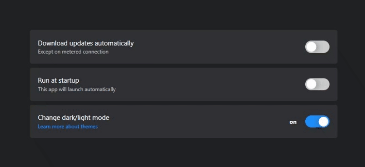

<!-- switch componet -->

# Switch component using CSS only

## Usage

```html
    <label for="switch" data-component="switch">
        <input type="checkbox" class="switch" />
    </label>
```

## API 
- **Getting Started**: To use the switch component, add the attribute `data-component="switch"`

- **Display State**: To display the switch state, add the attributes `data-on="Value to be displayed when on"` and `data-off="Value to be displayed when off"` to the label with the `data-component="switch"` attribute.

## Example

```html
    <label for="switch" data-component="switch" data-on="On" data-off="Off">
        <input type="checkbox" class="switch" />
    </label>
```

## Demo




### Author | Developer

[Tedane Blake](https://tedtalksbits.github.io/tedaneblakedev/)